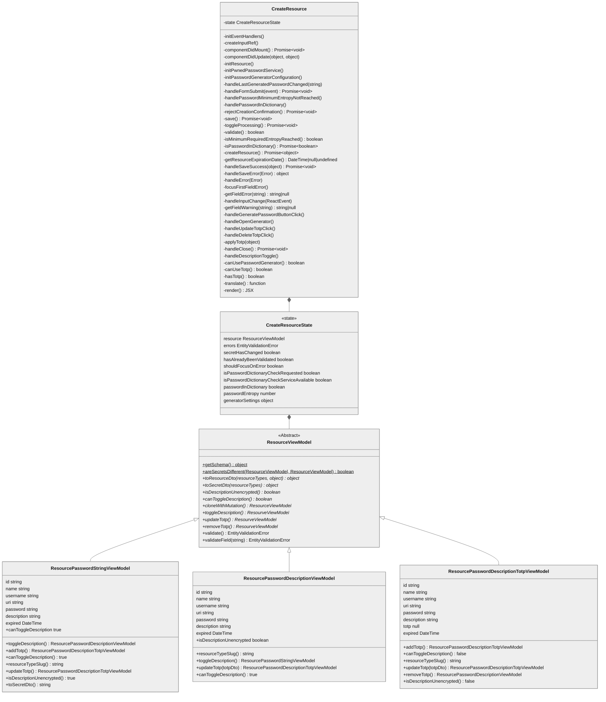

```mermaid
%%{init: {'theme':'neutral'}}%%
classDiagram

    class ResourceViewModel {
        <<Abstract>>
        +getSchema()$ object
        +areSecretsDifferent(ResourceViewModel, ResourceViewModel)$ boolean

        +toResourceDto(resourceTypes, object)* object
        +toSecretDto(resourceTypes)* object
        +isDescriptionUnencrypted()* boolean
        +canToggleDescription()* boolean
        +cloneWithMutation()* ResourceViewModel
        +toggleDescription()* ResourveViewModel
        +updateTotp()* ResourveViewModel
        +removeTotp()* ResourveViewModel

        +validate() EntityValidationError
        +validateField(string) EntityValidationError
    }

    class CreateResource {
        -state CreateResourceState
        -initEventHandlers()
        -createInputRef()
        -componentDidMount() Promise~void~
        -componentDidUpdate(object, object)
        -initResource()
        -initPwnedPasswordService()
        -initPasswordGeneratorConfiguration()
        -handleLastGeneratedPasswordChanged(string)
        -handleFormSubmit(event) Promise~void~
        -handlePasswordMinimumEntropyNotReached()
        -handlePasswordInDictionary()
        -rejectCreationConfirmation() Promise~void~
        -save() Promise~void~
        -toggleProcessing() Promise~void~
        -validate() boolean
        -isMinimumRequiredEntropyReached() boolean
        -isPasswordInDictionary() Promise~boolean~
        -createResource() Promise~object~
        -getResourceExpirationDate() DateTime|null|undefined
        -handleSaveSuccess(object) Promise~void~
        -handleSaveError(Error) object
        -handleError(Error)
        -focusFirstFieldError()
        -getFieldError(string) string|null
        -handleInputChange(ReactEvent)
        -getFieldWarning(string) string|null
        -handleGeneratePasswordButtonClick()
        -handleOpenGenerator()
        -handleUpdateTotpClick()
        -handleDeleteTotpClick()
        -applyTotp(object)
        -handleClose() Promise~void~
        -handleDescriptionToggle()
        -canUsePasswordGenerator() boolean
        -canUseTotp() boolean
        -hasTotp() boolean
        -translate() function
        -render() JSX
    }

    class CreateResourceState {
        <<state>>
        resource ResourceViewModel
        errors EntityValidationError
        secretHasChanged boolean
        hasAlreadyBeenValidated boolean
        shouldFocusOnError boolean
        isPasswordDictionaryCheckRequested boolean
        isPasswordDictionaryCheckServiceAvailable boolean
        passwordInDictionary boolean
        passwordEntropy number
        generatorSettings object
    }

    class ResourcePasswordStringViewModel {
        id string
        name string
        username string
        uri string
        password string
        description string
        expired DateTime

        +toggleDescription() ResourcePasswordDescriptionViewModel
        +addTotp() ResourcePasswordDescriptionTotpViewModel
        +canToggleDescription() true
        +resourceTypeSlug() string
        +canToggleDescription true
        +updateTotp() ResourcePasswordDescriptionTotpViewModel
        +isDescriptionUnencrypted() true
        +toSecretDto() string
    }

    class ResourcePasswordDescriptionViewModel {
        id string
        name string
        username string
        uri string
        password string
        description string
        expired DateTime

        +resourceTypeSlug() string
        +toggleDescription() ResourcePasswordStringViewModel
        +updateTotp(totpDto) ResourcePasswordDescriptionTotpViewModel
        +isDescriptionUnencrypted boolean
        +canToggleDescription() true
    }

    class ResourcePasswordDescriptionTotpViewModel {
        id string
        name string
        username string
        uri string
        password string
        description string
        totp null
        expired DateTime

        +addTotp() ResourcePasswordDescriptionTotpViewModel
        +canToggleDescription() false
        +resourceTypeSlug() string
        +updateTotp(totpDto) ResourcePasswordDescriptionTotpViewModel
        +removeTotp() ResourcePasswordDescriptionViewModel
        +isDescriptionUnencrypted() false
    }

    ResourceViewModel <|-- ResourcePasswordStringViewModel
    ResourceViewModel <|-- ResourcePasswordDescriptionViewModel
    ResourceViewModel <|-- ResourcePasswordDescriptionTotpViewModel

    CreateResource *-- CreateResourceState
    CreateResourceState *-- ResourceViewModel
```
