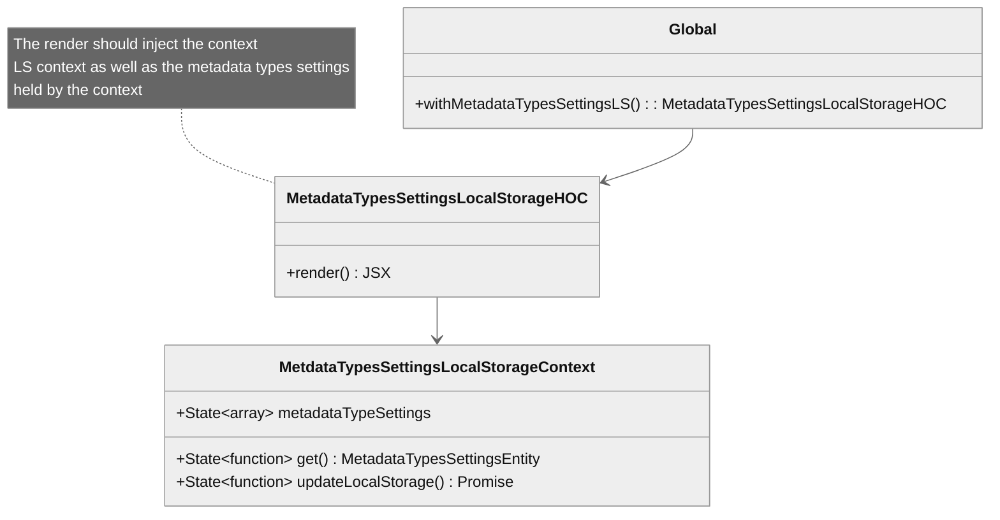

```mermaid
%%{init: {'theme':'neutral'}}%%
classDiagram
    class MetdataTypesSettingsLocalStorageContext{
        +State~function~ get() MetadataTypesSettingsEntity
        +State~array~ metadataTypeSettings
        +State~function~ updateLocalStorage() Promise
    }

    class Global{
        +withMetadataTypesSettingsLS(): MetadataTypesSettingsLocalStorageHOC
    }

    note for MetadataTypesSettingsLocalStorageHOC "The render should inject the context <br>LS context as well as the metadata types settings <br> held by the context"
    class MetadataTypesSettingsLocalStorageHOC{
        +render() JSX
    }

    Global-->MetadataTypesSettingsLocalStorageHOC
    MetadataTypesSettingsLocalStorageHOC-->MetdataTypesSettingsLocalStorageContext
```
