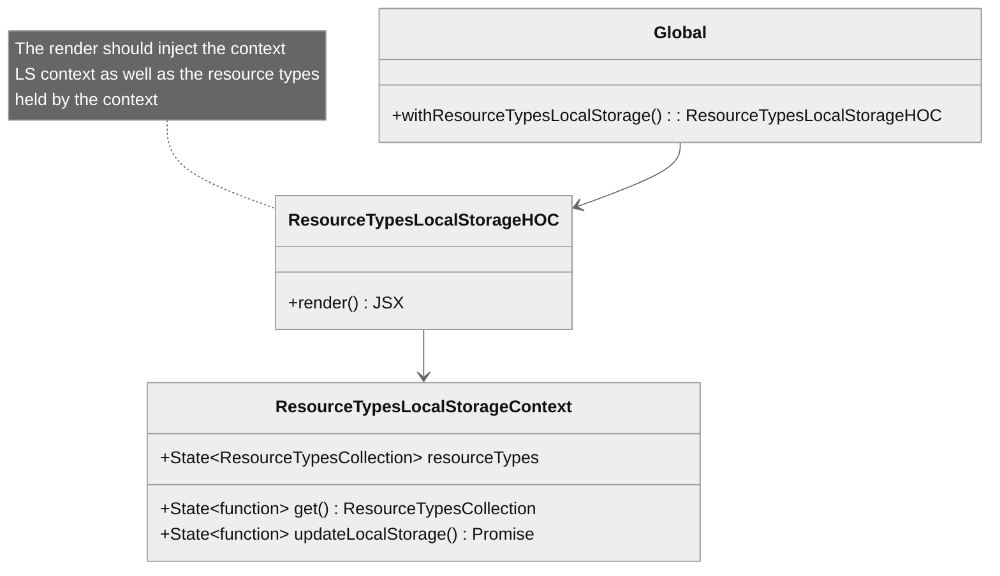

```mermaid
%%{init: {'theme':'neutral'}}%%
classDiagram
    class ResourceTypesLocalStorageContext{
        +State~function~ get() ResourceTypesCollection
        +State~ResourceTypesCollection~ resourceTypes
        +State~function~ updateLocalStorage() Promise
    }

    class Global{
        +withResourceTypesLocalStorage(): ResourceTypesLocalStorageHOC
    }

    note for ResourceTypesLocalStorageHOC "The render should inject the context <br>LS context as well as the resource types <br> held by the context"
    class ResourceTypesLocalStorageHOC{
        +render() JSX
    }

    Global-->ResourceTypesLocalStorageHOC
    ResourceTypesLocalStorageHOC-->ResourceTypesLocalStorageContext
```
