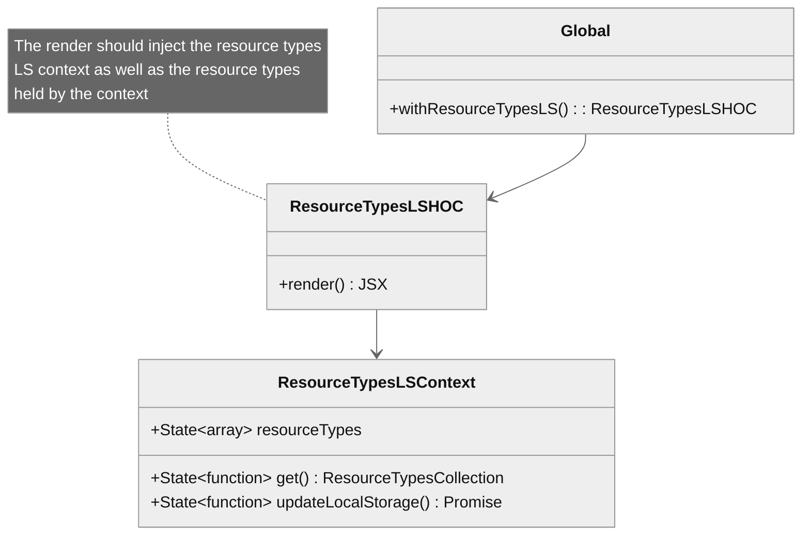

```mermaid
%%{init: {'theme':'neutral'}}%%
classDiagram
    class ResourceTypesLSContext{
        +State~function~ get() ResourceTypesCollection
        +State~array~ resourceTypes
        +State~function~ updateLocalStorage() Promise
    }

    class Global{
        +withResourceTypesLS(): ResourceTypesLSHOC
    }

    note for ResourceTypesLSHOC "The render should inject the resource types <br>LS context as well as the resource types <br> held by the context"
    class ResourceTypesLSHOC{
        +render() JSX
    }

    Global-->ResourceTypesLSHOC
    ResourceTypesLSHOC-->ResourceTypesLSContext
```
