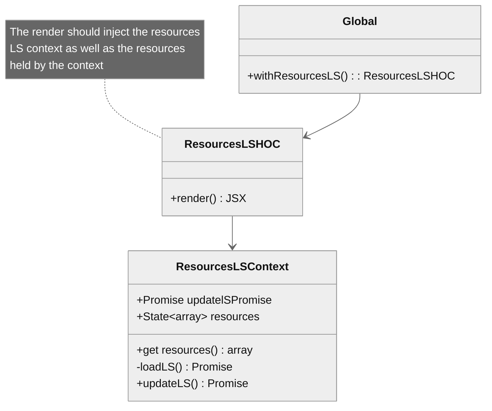

```mermaid
%%{init: {'theme':'neutral'}}%%
classDiagram
    class ResourcesLSContext{
        +Promise updatelSPromise
        +State~array~ resources
        +get resources() array
        -loadLS() Promise
        +updateLS() Promise
    }

    class Global{
        +withResourcesLS(): ResourcesLSHOC
    }

    note for ResourcesLSHOC "The render should inject the resources <br>LS context as well as the resources <br> held by the context"
    class ResourcesLSHOC{
        +render() JSX
    }

    Global-->ResourcesLSHOC
    ResourcesLSHOC-->ResourcesLSContext
```
