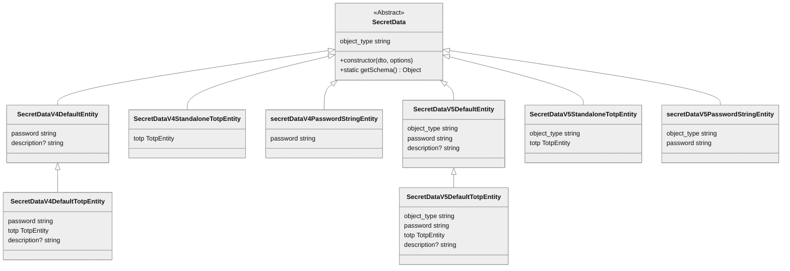

```mermaid
%%{init: {'theme':'neutral'}}%%
classDiagram

    class SecretData {
        <<Abstract>>
        object_type string
        +constructor(dto, options)
        +static getSchema() Object
    }

    class SecretDataV4DefaultEntity {
        password string
        description? string
    }

    class SecretDataV4DefaultTotpEntity {
        password string
        totp TotpEntity
        description? string
    }

    class SecretDataV4StandaloneTotpEntity {
        totp TotpEntity
    }

    class secretDataV4PasswordStringEntity {
        password string
    }

    class SecretDataV5DefaultEntity {
        object_type string
        password string
        description? string
    }

    class SecretDataV5DefaultTotpEntity {
        object_type string
        password string
        totp TotpEntity
        description? string
    }

    class SecretDataV5StandaloneTotpEntity {
        object_type string
        totp TotpEntity
    }

    class secretDataV5PasswordStringEntity {
        object_type string
        password string
    }

    SecretData <|-- SecretDataV4DefaultEntity
    SecretDataV4DefaultEntity <|-- SecretDataV4DefaultTotpEntity
    SecretData <|-- SecretDataV4StandaloneTotpEntity
    SecretData <|-- secretDataV4PasswordStringEntity
    SecretData <|-- SecretDataV5DefaultEntity
    SecretDataV5DefaultEntity <|-- SecretDataV5DefaultTotpEntity
    SecretData <|-- SecretDataV5StandaloneTotpEntity
    SecretData <|-- secretDataV5PasswordStringEntity
```
