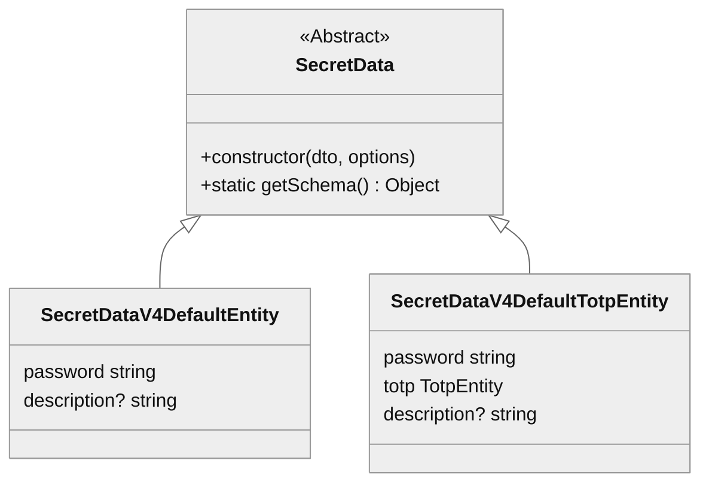

```mermaid
%%{init: {'theme':'neutral'}}%%
classDiagram

    class SecretData {
        <<Abstract>>
        +constructor(dto, options)
        +static getSchema() Object
    }

    class SecretDataV4DefaultEntity {
        password string
        description? string
    }

    class SecretDataV4DefaultTotpEntity {
        password string
        totp TotpEntity
        description? string
    }

    SecretData <|-- SecretDataV4DefaultEntity
    SecretData <|-- SecretDataV4DefaultTotpEntity
```
